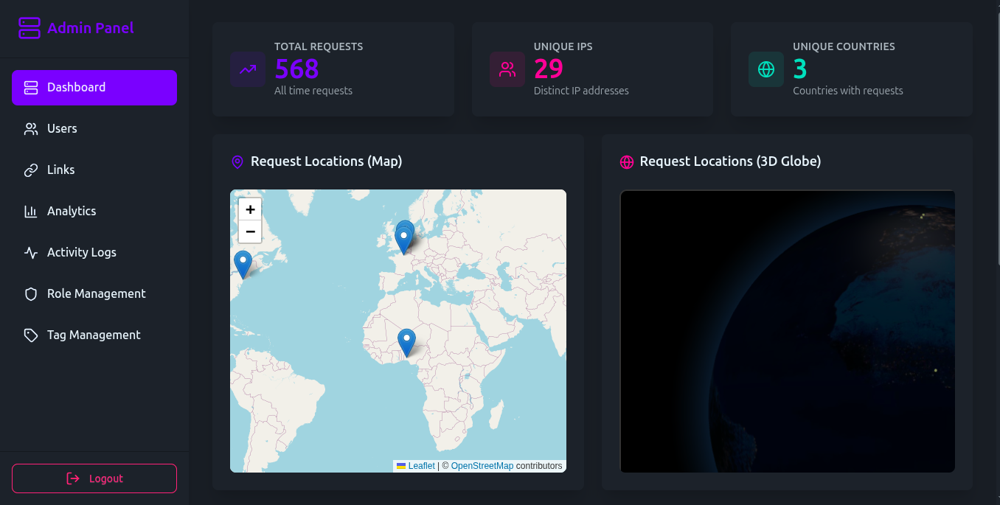

# 🚀 URL Shortener SaaS Platform



A comprehensive, enterprise-grade URL shortening service built with Node.js, Express, Prisma, and React. Features advanced analytics, role-based access control, billing integration, and AI-powered management through MCP (Model Context Protocol).

## 📋 Table of Contents

- [Features](#-features)
- [Architecture](#-architecture)
- [Quick Start](#-quick-start)
- [API Documentation](#-api-documentation)
- [Admin Panel](#-admin-panel)
- [MCP Server](#-mcp-server)
- [Configuration](#-configuration)
- [Deployment](#-deployment)
- [Contributing](#-contributing)

## ✨ Features

### 🔗 Core URL Shortening
- **Fast Link Creation**: Generate short URLs with custom slugs or auto-generated ones
- **Password Protection**: Secure links with passwords
- **Expiration Dates**: Set link expiration times
- **Bulk Operations**: Create, update, and delete multiple links at once
- **Click Tracking**: Comprehensive analytics for every link click

### 📊 Advanced Analytics
- **Real-time Statistics**: Track clicks, geographic data, and user agents
- **Device & Browser Analysis**: Understand your audience demographics
- **Referral Tracking**: Monitor traffic sources and campaigns
- **Time-based Reports**: Hourly, daily, and custom date range analytics
- **Export Capabilities**: Download reports in various formats

### 👥 User Management & Security
- **Multi-user Support**: Separate accounts with API key authentication
- **Role-Based Access Control**: Granular permissions system
- **Admin Dashboard**: Complete system management interface
- **Activity Logging**: Track all user actions and system events
- **Rate Limiting**: Prevent abuse with configurable limits

### 💳 Billing & Subscription
- **Stripe Integration**: Secure payment processing
- **Flexible Plans**: Multiple subscription tiers
- **Usage Tracking**: Monitor API calls and feature usage
- **Automated Billing**: Recurring payments and upgrades/downgrades

### 🤖 AI Integration (MCP)
- **Model Context Protocol**: AI systems can interact with your URL shortener
- **Automated Link Management**: AI can create, analyze, and manage links
- **Smart Analytics**: AI-powered insights and recommendations
- **Bulk Operations**: AI can perform complex bulk operations

## 🏗️ Architecture

```
┌─────────────────┐    ┌─────────────────┐    ┌─────────────────┐
│   React Admin   │    │   Express API   │    │   MCP Server    │
│     Panel       │◄──►│     Server      │◄──►│   (AI Tools)    │
│                 │    │                 │    │                 │
├─────────────────┤    ├─────────────────┤    ├─────────────────┤
│ • Dashboard     │    │ • REST API      │    │ • Link Tools    │
│ • Link Mgmt     │    │ • WebSocket     │    │ • Analytics     │
│ • User Mgmt     │    │ • Rate Limiting │    │ • User Mgmt     │
│ • Analytics     │    │ • Auth/JWT      │    │ • Automation    │
└─────────────────┘    └─────────────────┘    └─────────────────┘
                           │
                           ▼
                    ┌─────────────────┐
                    │   Database      │
                    │   (SQLite)      │
                    │                 │
                    ├─────────────────┤
                    │ • Links         │
                    │ • Users         │
                    │ • Analytics     │
                    │ • Billing       │
                    │ • Activity Logs │
                    └─────────────────┘
```

## 🚀 Quick Start

### Prerequisites
- Node.js 20+
- pnpm (recommended) or npm
- SQLite (included with project)

### Installation

1. **Clone the repository**
   ```bash
   git clone <repository-url>
   cd url-shortener-saas
   ```

2. **Install dependencies**
   ```bash
   # Backend dependencies
   pnpm install

   # Frontend dependencies
   cd frontend
   pnpm install
   cd ..
   ```

3. **Environment Setup**
   ```bash
   cp .env.example .env
   # Edit .env with your configuration
   ```

4. **Database Setup**
   ```bash
   # Generate Prisma client
   npx prisma generate

   # Run migrations
   npx prisma migrate dev

   # Seed the database
   pnpm run db:seed
   ```

5. **Build and Start**
   ```bash
   # Build frontend
   cd frontend
   pnpm run build
   cd ..

   # Start backend
   pnpm run start
   ```

The application will be available at:
- **API**: http://localhost:4000
- **Admin Panel**: http://localhost:4000 (served by backend)
- **API Docs**: http://localhost:4000/docs

## 📚 API Documentation

### Authentication
The API uses multiple authentication methods:

- **API Key Authentication**: For link management operations
- **JWT Authentication**: For user account management
- **Admin Authentication**: For administrative operations

### Core Endpoints

#### Link Management
```http
POST   /api/links           # Create link
GET    /api/links           # List links (with pagination)
PUT    /api/links/:id       # Update link
DELETE /api/links/:id       # Delete link
GET    /api/links/:slug/stats # Get link analytics

POST   /api/links/bulk      # Bulk create links
PUT    /api/links/bulk      # Bulk update links
DELETE /api/links/bulk      # Bulk delete links
```

#### User Management
```http
POST   /signup              # User registration
POST   /login               # User login
POST   /api/api-keys        # Generate API key
PUT    /api/password        # Change password
```

#### Analytics & Reports
```http
GET    /api/reports/analytics    # User analytics
GET    /api/reports/generate     # Generate custom reports
GET    /api/reports/export       # Export data
```

#### Billing
```http
GET    /api/billing/subscription    # Get subscription
POST   /api/billing/subscription    # Create subscription
PUT    /api/billing/subscription    # Update subscription
GET    /api/billing/plans          # List pricing plans
```

### Pagination
All list endpoints support limit-offset pagination:
- `limit`: Maximum 20 items per request
- `offset`: Number of items to skip

Example:
```http
GET /api/links?limit=10&offset=20
```

## 🎛️ Admin Panel

The admin panel provides a comprehensive web interface for system management.

### Features

#### 📊 Dashboard
- **Real-time Metrics**: Live statistics and KPIs
- **System Health**: Server status and performance monitoring
- **Recent Activity**: Latest user actions and system events

#### 🔗 Link Management
- **Link CRUD**: Create, read, update, delete links
- **Bulk Operations**: Mass link management
- **Tag Management**: Organize links with tags
- **Search & Filter**: Find links quickly

#### 👤 User Management
- **User CRUD**: Manage user accounts
- **Role Assignment**: Assign roles and permissions
- **API Key Management**: Generate and revoke API keys
- **Activity Monitoring**: Track user behavior

#### 📈 Analytics
- **Global Analytics**: System-wide statistics
- **User Analytics**: Individual user performance
- **Geographic Data**: Click distribution by country/city
- **Device Analytics**: Browser and device breakdown

#### 🛡️ Security & Access Control
- **Role Management**: Create and manage user roles
- **Permission System**: Granular access control
- **Activity Logs**: Complete audit trail
- **Rate Limiting**: Configure abuse prevention

### Access
- **URL**: http://localhost:4000
- **Login**: Use admin credentials from `.env`
- **Default Admin**: Check database seed or environment variables

## 🤖 MCP Server

The Model Context Protocol server enables AI systems to interact with your URL shortener programmatically.

### Available Tools

#### Link Management
- `create_short_link`: Create new short links
- `list_user_links`: Retrieve user's links with pagination
- `update_link`: Modify existing links
- `delete_link`: Remove links
- `bulk_create_links`: Create multiple links at once
- `get_link_analytics`: Get detailed link statistics

#### Analytics & Admin (Admin Only)
- `get_global_analytics`: System-wide analytics
- `list_all_links`: View all links in the system
- `manage_users`: User account management

### Configuration
Add to your MCP client configuration:

```json
{
  "mcpServers": {
    "url-shortener": {
      "command": "node",
      "args": ["/path/to/mcp-server/build/index.js"],
      "env": {
        "URL_SHORTENER_API_BASE_URL": "http://localhost:4000",
        "URL_SHORTENER_API_KEY": "your-api-key",
        "URL_SHORTENER_ADMIN_EMAIL": "admin@example.com",
        "URL_SHORTENER_ADMIN_PASSWORD": "admin-password",
        "URL_SHORTENER_MCP_ENABLED": "true"
      }
    }
  }
}
```

### AI Use Cases
- **Automated Link Creation**: AI can create links based on content analysis
- **Smart Analytics**: AI can analyze traffic patterns and suggest optimizations
- **Bulk Operations**: AI can perform complex bulk management tasks
- **Content Management**: AI can organize and categorize links automatically

## ⚙️ Configuration

### Environment Variables

Create a `.env` file in the root directory:

```env
# Database
DATABASE_URL="file:./prisma/dev.db"

# JWT & Security
JWT_SECRET="your-super-secret-jwt-key-change-in-production"
BCRYPT_ROUNDS=10

# Server
PORT=4000
NODE_ENV="development"

# Stripe (for billing)
STRIPE_SECRET_KEY="sk_test_..."
STRIPE_WEBHOOK_SECRET="whsec_..."
STRIPE_PUBLISHABLE_KEY="pk_test_..."

# Email (optional)
SMTP_HOST="smtp.gmail.com"
SMTP_PORT=587
SMTP_USER="your-email@gmail.com"
SMTP_PASS="your-app-password"

# MCP Server (optional)
URL_SHORTENER_MCP_ENABLED=true
```

### Database Schema

The application uses Prisma ORM with SQLite:

- **Users**: User accounts with roles and permissions
- **Links**: Shortened URLs with metadata
- **Clicks**: Click tracking and analytics
- **ApiKeys**: Authentication tokens
- **ActivityLogs**: Audit trail
- **Subscriptions**: Billing and plans
- **Roles & Permissions**: Access control

## 🚢 Deployment

### Docker Deployment

1. **Build and run with Docker Compose**
   ```bash
   docker-compose up -d
   ```

2. **Access the application**
   - API: http://localhost:4000
   - Admin Panel: http://localhost:4000

### Manual Deployment

1. **Build the application**
   ```bash
   # Build frontend
   cd frontend
   pnpm run build
   cd ..

   # Generate Prisma client
   npx prisma generate

   # Run migrations
   npx prisma migrate deploy
   ```

2. **Start the server**
   ```bash
   pnpm run start
   ```

### Production Considerations

- **Environment Variables**: Set strong secrets and API keys
- **Database**: Consider PostgreSQL for production
- **Caching**: Implement Redis for session and rate limiting
- **SSL/TLS**: Enable HTTPS in production
- **Monitoring**: Set up logging and monitoring
- **Backups**: Regular database backups

## 🤝 Contributing

1. Fork the repository
2. Create a feature branch: `git checkout -b feature/amazing-feature`
3. Commit your changes: `git commit -m 'Add amazing feature'`
4. Push to the branch: `git push origin feature/amazing-feature`
5. Open a Pull Request

### Development Setup

```bash
# Install dependencies
pnpm install
cd frontend && pnpm install && cd ..

# Start development servers
pnpm run dev          # Backend
cd frontend && pnpm run dev  # Frontend (separate terminal)
```

### Code Quality

- **ESLint**: JavaScript/React linting
- **Prettier**: Code formatting
- **TypeScript**: Type checking for MCP server
- **Prisma**: Database schema validation

## 📄 License

This project is licensed under the MIT License - see the [LICENSE](LICENSE) file for details.

## 🆘 Support

- **Issues**: [GitHub Issues](https://github.com/your-repo/issues)
- **Discussions**: [GitHub Discussions](https://github.com/your-repo/discussions)
- **Documentation**: [API Docs](http://localhost:4000/docs)

---

Built with ❤️ using Node.js, Express, React, Prisma, and modern web technologies.
